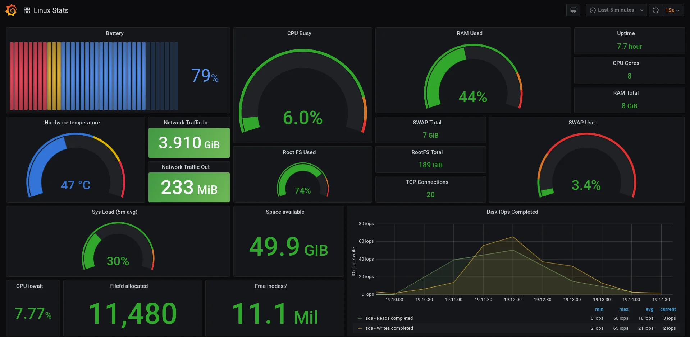

## 🖥️ Monitorización

</img>

***

- **La Monitorización :** es clave para saber cómo están funcionando los sistemas y las redes. Con ella, puedes detectar problemas a tiempo, mejorar el rendimiento y asegurar que todo esté disponible cuando se necesita. En este documento, descubrirás las herramientas y métodos más útiles para monitorizar de forma sencilla y eficaz.

***

## Contenidos :

[1. Herramientas propias del sistema ](content/herramientas.md)

En esta sección, se presentan algunas herramientas propias del sistema que son útiles para la monitorización.

### Procesos 🔄⚙️

[1-a- Top ](content/proc/top.md)

[1-b- Atop](content/proc/atop.md)

[1-c- Htop](content/proc/htop.md)

***

### Discos 💾💽

[2-a- Df ](content/disk/df.md)

[2-b- Du ](content/disk/du.md)

[2-c- Iostat ](content/disk/iostat.md)

[2-d- Lsof ](content/disk/lsof.md)

[2-e- Blkid ](content/disk/blkid.md)

[2-f- Fdisk ](content/disk/fdisk.md)

***

### Redes 🌐🛜 

[3-a- Tcpdump ](content/net/tcpdump.md)

[3-b- Tcptrak ](content/net//tcptrak.md)

[3-c- Iptraf ](content/net/iptraf.md)

[3-d- Netstat ](content/net/netstat.md)

***

### Monitorización :

[2- Sistemas de monitorización ](content2/monitorizacion.md)

[A- Instalar Prometheus ](content2/promotheus.md)

[B- Instalar NODE EXPORTER ](content2/node.md)

[C- Instalar Grafana ](content2/grafana.md)

[D- Script Apache Exporter](content2/apache_exporter.sh)

[E- Script2](content2/pro.sh)
