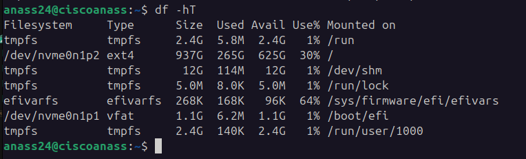

# 💾 Comando df: Análisis de Espacio en Sistemas de Archivos




## 📝 Descripción General
El comando `df` (disk free) es una herramienta esencial en sistemas Linux/Unix para obtener información detallada sobre el uso de espacio en los sistemas de archivos.

## 🔍 Opciones Principales

| Opción | Descripción | Ejemplo de Uso |
|--------|-------------|----------------|
| `-h` | Formato legible para humanos | `df -h` |
| `-T` | Muestra tipo de sistema de archivos | `df -T` |
| `-i` | Información de inodos (archivos) | `df -i` |
| `-a` | Todos los sistemas de archivos | `df -a` |

## 💻 Ejemplos Prácticos

### Uso Básico
```bash
# Mostrar espacio en disco legible
df -h

# Mostrar tipos de sistemas de archivos
df -T

# Combinación de opciones
df -hT
```

### Análisis Detallado
```bash
# Uso de inodos
df -i

# Todos los sistemas de archivos
df -a

# Formato completo
df -aha
```

## 🧐 Desglose de Salida Típica
```
Filesystem     Type     1K-blocks      Used  Available  Use%  Mounted on
/dev/sda1      ext4     100G            60G   40G       60%   /
/dev/sdb1      xfs      500G           200G  300G      40%   /home
```

