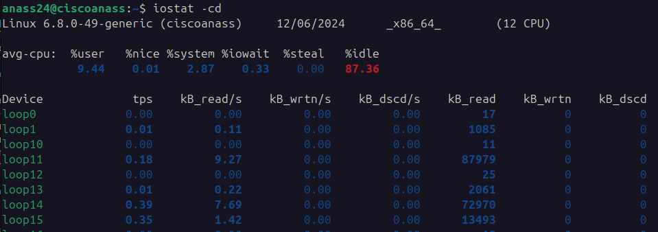

# 💽 Comando iostat: Estadísticas de E/S del Sistema




## 📝 Descripción
`iostat` analiza el rendimiento de dispositivos de almacenamiento y CPU, proporcionando información detallada sobre actividad de entrada/salida.

## 🔍 Opciones Principales

| Opción | Descripción | Ejemplo |
|--------|-------------|---------|
| `-c` | Resumen de CPU | `iostat -c` |
| `-d` | Resumen de dispositivos | `iostat -d` |
| `-h` | Formato legible | `iostat -h` |
| `-t` | Mostrar tiempo | `iostat -t` |

## 💻 Ejemplos Prácticos

```bash
# Estadísticas básicas
iostat

# Resumen de CPU y dispositivos
iostat -cd

# Actualización cada 2 segundos
iostat 2

# Formato legible con tiempo
iostat -ht
```

## 💡 Consejos Rápidos
- Monitorea rendimiento de discos
- Identifica cuellos de botella de E/S
- Útil para diagnóstico de problemas de rendimiento