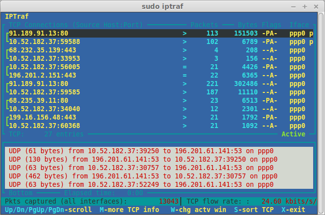

# 🌐 Herramienta IPTraf: Análisis Detallado de Tráfico de Red

</img>

## 📝 Descripción
`iptraf` es una potente herramienta de monitoreo de red basada en texto que proporciona información detallada y en tiempo real sobre el tráfico IP, permitiendo a administradores de sistemas y profesionales de red realizar diagnósticos y análisis exhaustivos.

## 🔍 Opciones Principales

| Opción | Descripción | Ejemplo de Uso |
|--------|-------------|----------------|
| `-i <interfaz>` | Especificar interfaz de red para monitoreo | `iptraf -i eth0` |
| `-g` | Mostrar estadísticas generales del tráfico | `iptraf -g` |
| `-t` | Estadísticas detalladas de conexiones TCP | `iptraf -t` |
| `-s` | Estadísticas de conexiones UDP | `iptraf -s` |
| `-z` | Análisis de tráfico ICMP | `iptraf -z` |
| `-x` | Estadísticas extendidas y avanzadas | `iptraf -x` |

## 💻 Ejemplos Prácticos

```bash
# Monitoreo básico de tráfico
sudo iptraf

# Monitoreo de interfaz específica
sudo iptraf -i eth0

# Estadísticas generales de red
sudo iptraf -g

# Análisis detallado de conexiones TCP
sudo iptraf -t

# Estadísticas extendidas
sudo iptraf -x
```

## 💡 Consejos Profesionales
- Use filtros para análisis específicos
- Combine opciones para diagnósticos precisos
- Requiere permisos de administrador
- Ideal para solución de problemas de red
- Minimice el impacto en el rendimiento del sistema

## 🔧 Requisitos del Sistema
- Sistema operativo Linux
- Privilegios de administrador
- Interfaces de red activas


## 📊 Información Adicional
- Herramienta de diagnóstico de código abierto
- Compatibilidad con múltiples distribuciones Linux
- Interfaz de texto ligera y eficiente
- Útil para administradores de sistemas y redes