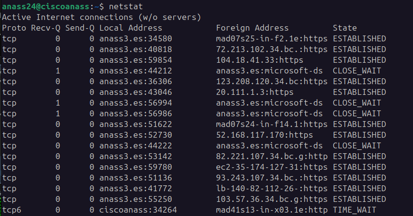

# 🌐 Herramienta Netstat: Análisis Completo de Conexiones de Red

</img>


## 📝 Descripción
`netstat` es una herramienta de línea de comandos fundamental para administradores de sistemas y profesionales de redes, proporcionando información detallada sobre conexiones de red, tablas de enrutamiento, estadísticas de interfaces y el estado de protocolos como TCP, UDP e ICMP.

## 🔍 Opciones Principales

| Opción | Descripción | Ejemplo de Uso |
|--------|-------------|----------------|
| `-a` | Mostrar todas las conexiones y puertos de escucha | `netstat -a` |
| `-t` | Visualizar exclusivamente conexiones TCP | `netstat -t` |
| `-u` | Visualizar exclusivamente conexiones UDP | `netstat -u` |
| `-n` | Mostrar direcciones IP y puertos numéricos | `netstat -n` |
| `-p` | Revelar ID de proceso de cada conexión | `netstat -p` |
| `-l` | Listar solo conexiones en estado de escucha | `netstat -l` |

## 💻 Ejemplos Prácticos

```bash
# Todas las conexiones de red
sudo netstat -a

# Conexiones TCP con información numérica
sudo netstat -tn

# Conexiones UDP con ID de procesos
sudo netstat -up

# Puertos en estado de escucha
sudo netstat -l

# Conexiones TCP con detalles de procesos
sudo netstat -tp
```

## 💡 Consejos Profesionales
- Combine opciones para análisis detallados
- Use `-n` para rendimiento más rápido
- `-p` ayuda en diagnóstico de procesos
- Requiere permisos de administrador
- Herramienta clave para solución de problemas de red

## 🔧 Requisitos del Sistema
- Sistemas Unix-like (Linux, macOS)
- Permisos de administrador
- Instalación de herramientas de red estándar

## 📊 Información Adicional
- Herramienta estándar en sistemas Unix
- Versatilidad en diagnóstico de red
- Sintaxis compatible con múltiples sistemas
- Fundamental en administración de sistemas
- Alternativas modernas: `ss`, `ip`