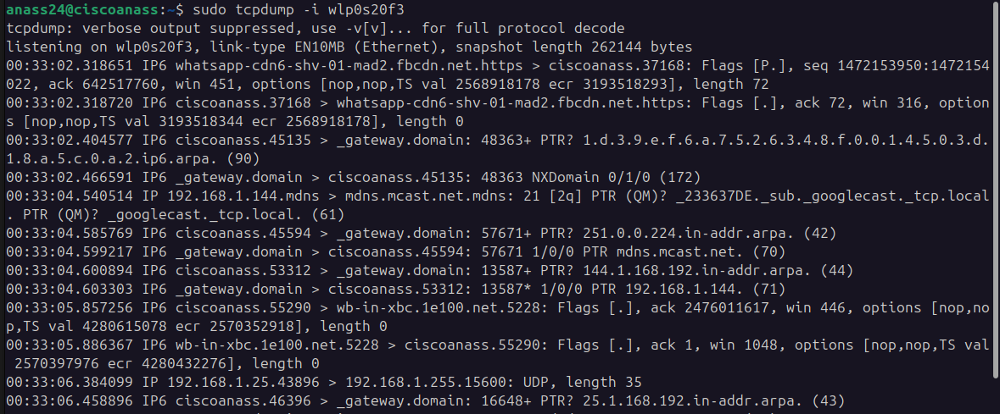

# 🌐 Comando tcpdump: Captura y Análisis de Paquetes de Red
</img>

## 📝 Descripción
`tcpdump` es una herramienta de línea de comandos para capturar y analizar tráfico de red en detalle, permitiendo inspeccionar paquetes en tiempo real o guardar para análisis posterior.

## 🔍 Opciones Principales

| Opción | Descripción | Ejemplo |
|--------|-------------|---------|
| `-i` | Interfaz de red | `tcpdump -i eth0` |
| `-n` | Mostrar IP directa | `tcpdump -n` |
| `-X` | Datos hex y ASCII | `tcpdump -X` |
| `-w` | Guardar captura | `tcpdump -w captura.pcap` |
| `-r` | Leer captura | `tcpdump -r captura.pcap` |
| `-c` | Límite de paquetes | `tcpdump -c 100` |
| `-s` | Longitud de captura | `tcpdump -s 0` |

## 💻 Ejemplos Prácticos

```bash
# Captura básica en interfaz eth0
sudo tcpdump -i eth0

# Capturar 100 paquetes de HTTP
sudo tcpdump -c 100 port 80

# Guardar captura para análisis
sudo tcpdump -w trafico.pcap

# Ver solo tráfico TCP
sudo tcpdump tcp

# Filtrar por IP
sudo tcpdump host 192.168.1.100
```

## 💡 Consejos Profesionales
- Use `-w` para análisis posterior
- Filtros precisos reducen ruido
- Combine opciones para análisis específicos
- Requiere permisos de administrador

