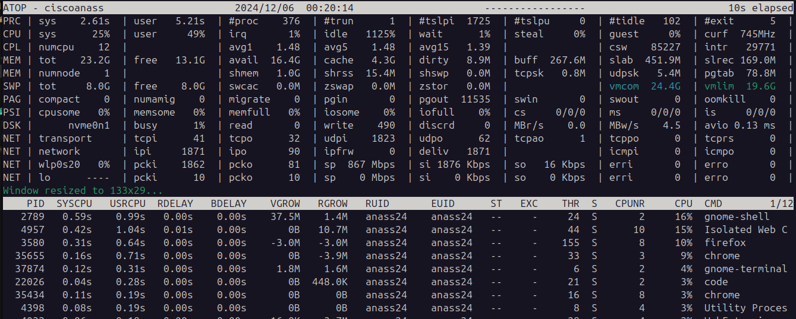

# 🖥️ Atop: Monitoreo Avanzado de Rendimiento del Sistema



## 📝 Descripción General
Atop es una herramienta de monitoreo de sistemas en tiempo real para sistemas Unix/Linux que destaca por su capacidad de almacenar y revisar datos históricos de rendimiento.

## 🔍 Diferencias Clave con Top
- Registro histórico de actividad del sistema
- Seguimiento detallado de recursos
- Capacidad de análisis retrospectivo

## 🚀 Opciones Principales de Atop

| Opción | Descripción | Ejemplo de Uso |
|--------|-------------|----------------|
| `-a` | Muestra todos los procesos | `atop -a` |
| `-d` | Cambia intervalo de actualización | `atop -d 5` |
| `-n` | Número de actualizaciones | `atop -n 10` |
| `-u` | Filtrar por usuario | `atop -u nombreusuario` |

## 💡 Comandos Interactivos

| Tecla | Función |
|-------|---------|
| `c` | Cambiar vista de procesos |
| `d` | Visualización de discos |
| `n` | Vista de red |
| `q` | Salir de la aplicación |

## 🔧 Características Avanzadas

### Almacenamiento de Datos
- Guarda estadísticas del sistema
- Comienza a recopilar datos desde la instalación
- Archivos de registro: `/var/log/atop_fecha`

### Gestión del Servicio
```bash
# Estado del servicio
systemctl status atop

# Archivo de configuración
/etc/default/atop
```

### 📦 Revisión de Registros Históricos
```bash
# Revisar registro de una fecha específica
atop -r /var/log/atop_fecha
```

## 🛠️ Instalación

### Distribuciones Basadas en Debian/Ubuntu
```bash
# Instalación con apt
sudo apt-get install atop
```

### Distribuciones Red Hat/CentOS
```bash
# Instalación con yum
sudo yum install atop
```

## 💻 Ejemplos Prácticos

```bash
# Monitoreo en tiempo real
atop

# Monitoreo cada 5 segundos
atop -d 5

# Monitoreo de 10 actualizaciones
atop -n 10

# Monitoreo de procesos de un usuario específico
atop -u nombreusuario
```

## 🔍 Consejos Profesionales
- Utiliza atop para análisis de rendimiento a largo plazo
- Revisa registros históricos para identificar patrones de consumo
- Combina con otras herramientas de monitoreo para análisis completo