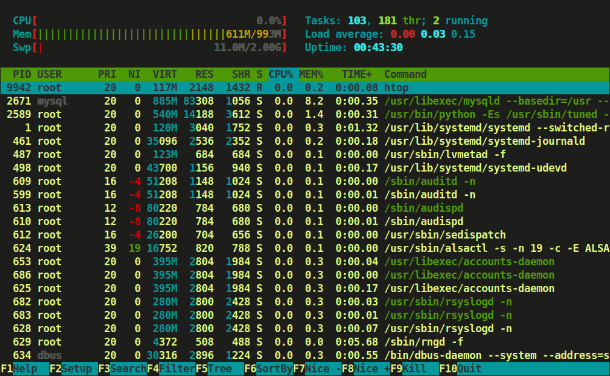

# 🖥️ Htop: Monitoreo Avanzado e Interactivo del Sistema



## 📝 Descripción General
Htop es una herramienta de monitoreo de sistemas en línea de comandos que mejora significativamente la experiencia de visualización de procesos en comparación con el comando top tradicional.

## 🌟 Características Principales

### Interfaz Mejorada
- **Diseño Gráfico Intuitivo:** Representación visual del uso de recursos
- **Navegación Interactiva:** Selección y gestión de procesos en tiempo real
- **Gráficos de Barras:** Visualización instantánea de uso de CPU y memoria

## 🔍 Teclas de Función Principales

| Tecla | Función | Descripción |
|-------|---------|-------------|
| `F2` | Configuración | Menú de configuración avanzada |
| `F4` | Filtro de Usuario | Filtrar procesos por usuario específico |
| `F5` | Ordenación | Ordenar procesos por diferentes criterios |
| `F9` | Gestión de Señales | Menú para enviar señales a procesos |
| `F10` | Salir | Cerrar la aplicación |

## 💡 Funcionalidades Avanzadas

### Gestión Interactiva de Procesos
- Selección directa de procesos
- Envío de señales (kill, pausar, continuar)
- Cambio dinámico de prioridades

### Visualización de Recursos
- Gráficos en tiempo real de:
  - Uso de CPU por núcleo
  - Consumo de memoria
  - Distribución de recursos por proceso

## 🛠️ Instalación

### Distribuciones Basadas en Debian/Ubuntu
```bash
# Instalación con apt
sudo apt-get update
sudo apt-get install htop
```

### Distribuciones Red Hat/CentOS
```bash
# Instalación con yum
sudo yum install htop
```

### Distribuciones Arch Linux
```bash
# Instalación con pacman
sudo pacman -S htop
```

## 💻 Ejemplos de Uso

```bash
# Inicio básico
htop

# Filtrar procesos de un usuario
htop -u nombreusuario

# Ordenar por uso de memoria
# Dentro de htop, presionar F6 y seleccionar "PERCENT_MEM"

# Enviar señal a un proceso
# 1. Seleccionar proceso
# 2. Presionar F9
# 3. Elegir señal (p. ej., SIGTERM, SIGKILL)
```


## ⚠️ Consideraciones
- Requiere más recursos que `top` tradicional
- Interfaz puede ser abrumadora para usuarios principiantes
- No disponible por defecto en todos los sistemas

## 🌐 Compatibilidad
- Sistemas Unix-like: Linux, macOS (con instalación adicional)
- Diferentes distribuciones con ligeras variaciones