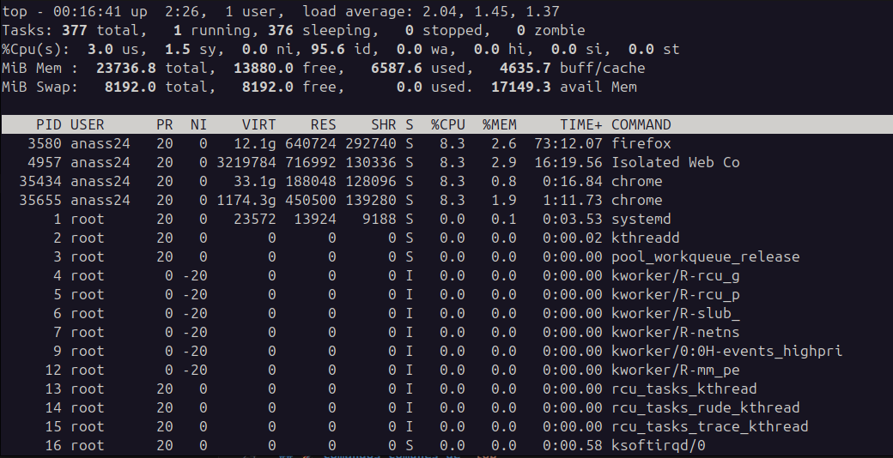

# 🖥️ Comando `top` de Linux: Monitoreo de Rendimiento del Sistema



## 📝 Descripción General
El comando `top` es una potente herramienta de monitoreo de sistemas en tiempo real en entornos Unix/Linux que proporciona información dinámica sobre el rendimiento del sistema y la actividad de los procesos.

## 🔍 Métricas de Procesos Explicadas

| Métrica | Descripción | Detalles |
|--------|-------------|---------|
| `PID` | ID de Proceso | Identificador único para procesos en ejecución |
| `USER` | Propietario del Proceso | Usuario que inició el proceso |
| `PR` | Prioridad | Prioridad de planificación del proceso |
| `NI` | Valor Nice | Influye en la prioridad del proceso |
| `VIRT` | Memoria Virtual | Memoria virtual total utilizada |
| `RES` | Memoria Residente | Consumo de RAM física |
| `SHR` | Memoria Compartida | Memoria compartida entre procesos |
| `%CPU` | Uso de CPU | Porcentaje de tiempo del procesador |
| `%MEM` | Uso de Memoria | Porcentaje de uso de RAM |
| `TIME+` | Tiempo de CPU | Tiempo total de CPU consumido |
| `COMMAND` | Ejecutable | Comando o ruta del proceso |

## 🚀 Comandos Comunes de `top`

```bash
# Uso Básico
top

# Opciones Avanzadas
top -o %CPU               # Ordenar por uso de CPU
top -o %MEM               # Ordenar por uso de memoria
top -u nombreusuario      # Filtrar por usuario
top -d segundos           # Cambiar intervalo de actualización
top -h                    # Mostrar ayuda

# Comandos Interactivos
# 'k': Terminar proceso
# 'e': Cambiar unidades de memoria
# 'f': Personalizar columnas
```

## 💡 Consejos Profesionales

- **Ordenación Rápida**: 
  - `Shift + M`: Ordenar por memoria
  - `Shift + P`: Ordenar por CPU
  - `Shift + E`: Alternar visualización de tiempo de CPU

- **Monitoreo de Rendimiento**:
  ```bash
  # Top 5 procesos intensivos en CPU
  top -o %CPU -n 5

  # Monitorear procesos de usuario cada 2 segundos
  top -u nombreusuario -d 2
  ```

## 🔧 Banderas Principales

| Bandera | Propósito |
|------|---------|
| `-d` | Establecer intervalo de refresco |
| `-u` | Filtrar por usuario |
| `-p` | Mostrar PIDs específicos |